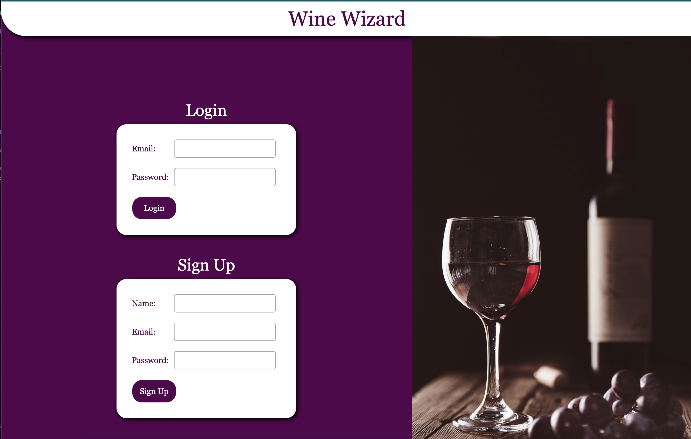

# Wine Wizard

## UCLA Bootcamp Project 2

## Description

An application that can help users quickly and efficiently find a match a wine for their meal, or vice versa. This app is meant to take the guesswork out of finding a complementing wine with your meal and saving past pairings to access again. Users will have access to professional pairing suggestions.

Upon viewing the website, the user will:

1. Be able to login or sign up.
2. Upon logging in, the user will be taken to homepage where they will see past wine/food pairings they have saved.
3. On the homepage, they will be able to search food keywords to see suggested wines via the Quick Match search bar.
4. On the homepage, users will be able to select a red/white wine and a wine type and will be taken to the search results page with the food pairings.
5. On the homepage, users will be able to select a food type and specific food option and will be taken to the search results page with the wine pairings.
6. On the search results page, users will be able to click on the wine picture and taken to an external link with more information.
7. Using the navbar, users will be able to logout.

Our motivation in building this project was to learn about wine and food pairings. We learned about get/post routes, through tables, how SQL table relationships affect how data is accessed, and how to parse data from classes and objects and put them into handlebars using handlebars syntax. We also reinforced our knowledge of API routes through controllers and corresponding index pages. We learned how to deploy to Heroku with a database.

## Installation
To install or access this project, use: <code>npm install</code>

In MySQL workbench, run the code stored in db/schema.sql.

To run seeds, use: <code>npm run seeds</code>

To run, use: <code>npm start</code>

## Usage

## Credits
This project was created by Ramita Indurkhya, John Huber, Eric Lee and Christa Lococo.